# Desarrolla360 Portal Empresarial

Portal B2B para administrar empresas clientes, sus empleados y su avance en cursos de `Tutor LMS Pro`, sin reemplazar el sitio público de WordPress.

- **Producción:** https://empresas.desarrolla360.com
- **Documentación técnica:** [Google Doc](https://docs.google.com/document/d/15FFbeow9qA0egQceBSOO3m3dXgoJnVEd3W8Rf7C33fA/edit?usp=drive_link) · [Diagrama en Excalidraw](https://excalidraw.com/#json=O0WQwOZZu5Y-I4MWcUmW-,Osa6Epzp7T0KP3kt3EvWkA)

## Diagrama de arquitectura



## Qué resuelve

El ecosistema se divide en dos frentes:

| Frente | Responsable de |
| --- | --- |
| WordPress + Tutor LMS Pro + WooCommerce | Marketing, venta individual y operación académica |
| Portal Empresarial (este repo) | Empresas, paquetes, cupos, dashboard RH, dashboard empleado y vista SuperAdmin |

Tres roles: **SuperAdmin** (alta de empresas, paquetes, monitoreo, control de accesos), **RH** (empleados, seguimiento por curso, constancias) y **Empleado** (sus cursos y constancias).

## Stack

Next.js (App Router) · NextAuth v5 (credenciales) · Prisma 7 · PostgreSQL (Supabase) · MUI + Tailwind

## Estructura del repo

| Carpeta | Contenido |
| --- | --- |
| [`src/`](src/README.md) | Código de la aplicación (rutas, componentes, lógica de dominio) |
| [`prisma/`](prisma/README.md) | Modelo de datos y migraciones |
| `docs/` | Arquitectura, integración con WordPress y especificaciones de features — solo local, no versionado (ver `.gitignore`) |
| [`docs-observability/`](docs-observability/README.md) | Informes de rendimiento, capacidad, costos y hand-off |
| [`wordpress-plugin/`](wordpress-plugin/README.md) | Plugin puente de WordPress (se despliega por separado) |
| [`load-testing/`](load-testing/README.md) | Suite de pruebas de carga (Artillery), sub-proyecto aislado |
| [`public/`](public/README.md) | Assets estáticos |

## Primeros pasos

```bash
npm install                 # instala dependencias y genera el cliente de Prisma
cp .env.example .env        # completa las variables (ver comentarios en el archivo)
npm run prisma:seed         # opcional: carga un SuperAdmin, empresa y empleado demo
npm run dev
```

`.env.example` es la referencia completa de variables, con comentarios donde el valor no es obvio (por ejemplo, por qué `DATABASE_URL` y `DIRECT_URL` apuntan a puertos distintos del pooler de Supabase).

Dos cosas que no son evidentes desde el `.env.example`:

- Si tu bridge de WordPress vive en `https://tu-dominio.com/wp-json/desarrolla360/v1`, entonces `NEXT_PUBLIC_WORDPRESS_SITE_URL` debe ser `https://tu-dominio.com`.
- Los paquetes que crean un `bundle privado` en Tutor LMS requieren el addon oficial `Course Bundle` activo en Tutor LMS Pro.

## Scripts

| Script | Qué hace |
| --- | --- |
| `npm run dev` | Servidor de desarrollo |
| `npm run build` | Genera el cliente de Prisma y compila para producción |
| `npm run start` | Sirve el build de producción |
| `npm run lint` | ESLint |
| `npm run format` / `format:check` | Prettier |
| `npx tsc --noEmit` | Typecheck |
| `npm run prisma:generate` | Regenera el cliente de Prisma |
| `npm run prisma:migrate` | Crea y aplica una migración en desarrollo |
| `npm run prisma:seed` | Carga los datos de prueba de `prisma/seed.ts` |

## Cron jobs (Vercel)

Definidos en `vercel.json`, autenticados con `Authorization: Bearer $CRON_SECRET` (Vercel lo agrega automáticamente). El proyecto está en plan Pro, sin límite práctico de cron jobs.

| Ruta | Horario | Qué hace |
| --- | --- | --- |
| `GET /api/cron/check-expiring-packages` | diario, 13:00 UTC | Notifica a SuperAdmin y RH cuando un paquete está por vencer (30 días antes) |
| `GET /api/internal/sync/employee-learning?limit=100` | cada minuto | Respaldo del webhook en tiempo real: sincroniza hasta 100 alumnos con acceso desactualizado |
| `GET/POST /api/cron/process-jobs` | cada minuto | Motor de jobs asíncronos — ver `src/lib/jobs.ts` |
| `GET /api/cron/bridge-health` | cada hora | Verifica que el bridge de WordPress responda y que el webhook no lleve más de 26h sin eventos |

`process-jobs` procesa la tabla `jobs` en chunks (20 elementos, concurrencia 5 por defecto): tareas costosas como sincronizar un paquete con todos los empleados de una empresa se encolan en vez de correr en la misma petición. Si el proyecto bajara a un plan con límite de cron jobs, habría que recortar esta lista y buscar un mecanismo de respaldo para `process-jobs`.

## Notas importantes

- El portal nunca lee la base de datos de WordPress directamente — toda la integración pasa por el plugin puente + REST API (`src/lib/wordpress/bridge.ts`).
- La venta de paquetes empresariales se administra fuera de WooCommerce; el portal solo aplica accesos, cupos y seguimiento.
- El empleado sigue consumiendo los cursos en Tutor LMS; el portal concentra el control empresarial y el reporting.
