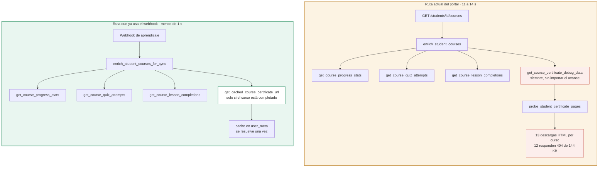
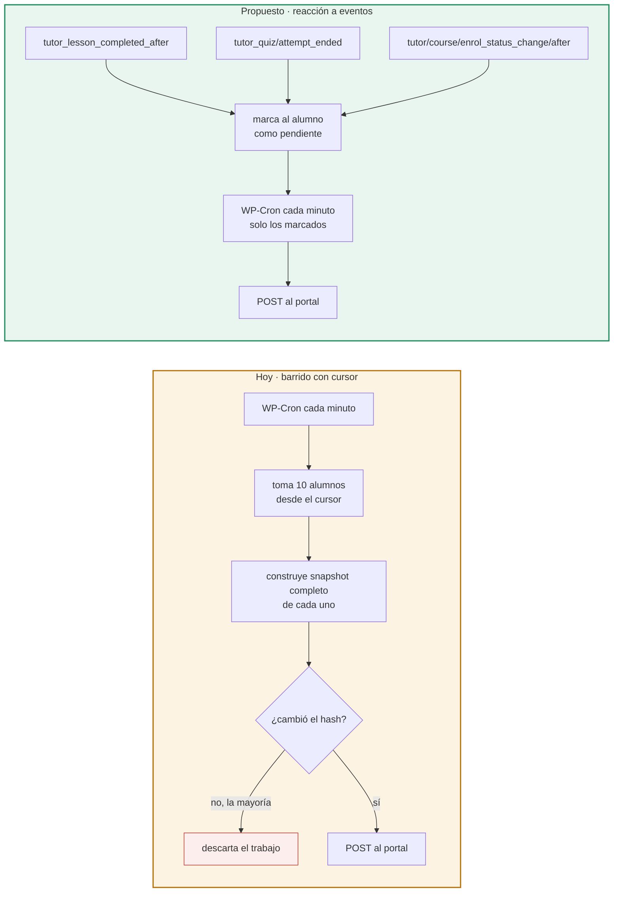

# Análisis del plugin puente con Tutor LMS

**Fecha:** 7 de septiembre de 2026
**Objeto analizado:** `wordpress-plugin/desarrolla360-bridge/desarrolla360-bridge.php`, versión 0.3.0
**Alcance:** revisión del código actual, mejoras propuestas y alternativas de mercado para sincronizar datos de Tutor LMS.

Documento relacionado: [PLAN-COLA-ASIGNACIONES.md](PLAN-COLA-ASIGNACIONES.md)

---

## 1. Resumen ejecutivo

El plugin resuelve bien el problema para el que fue escrito y contiene decisiones acertadas que conviene conservar. Su costo de ejecución, sin embargo, se concentra en un punto muy localizado.

El hallazgo principal es que **el plugin ya contiene la versión rápida de la función lenta**. Existen dos funciones que enriquecen los cursos de un alumno: una liviana que usa caché y solo consulta el certificado cuando el curso está completado, y otra pesada que descarga 13 páginas HTML por curso. El webhook usa la liviana. El endpoint que consulta el portal usa la pesada.

| Aspecto | Estado |
| --- | --- |
| Corrección funcional | Adecuada. La inscripción es idempotente y la autenticación usa comparación en tiempo constante |
| Rendimiento del endpoint principal | Deficiente. De 11 a 14 segundos por alumno, evitable |
| Estrategia de sincronización | Barrido periódico completo, no reacción a eventos |
| Mantenibilidad | Un archivo de 4,614 líneas, sin pruebas automatizadas |
| Seguridad | Correcta en lo esencial, con un efecto secundario a corregir |

La corrección de mayor impacto consiste en cambiar qué función invoca un endpoint. Es un cambio de una línea.

---

## 2. Inventario del código

| Métrica | Valor |
| --- | --- |
| Líneas | 4,614 en un solo archivo (133 KB) |
| Funciones | 120, todas en el espacio de nombres global con prefijo `d360_bridge_` |
| Rutas REST expuestas | 15, bajo `/wp-json/desarrolla360/v1/` |
| Consultas directas con `wpdb` | 33, de las cuales 11 usan `prepare` |
| Consultas por `get_posts` o `WP_Query` | 12 |
| Llamadas HTTP salientes | 3 puntos, uno de ellos dentro de un bucle |
| Pruebas automatizadas | Ninguna |
| Gestión de dependencias | Ninguna, sin `composer.json` |

Las funciones más extensas son `d360_bridge_register_rest_routes` (152 líneas), `d360_bridge_get_course_progress_stats` (138) y `d360_bridge_create_bundle` (135).

---

## 3. Lo que está bien resuelto

Conviene registrarlo para no romperlo en una refactorización.

**Autenticación con comparación en tiempo constante.** `d360_bridge_rest_permissions` valida la cabecera `X-D360-Portal-Key` con `hash_equals`, que evita ataques de temporización. Acepta también un `Bearer` como alternativa. Las 15 rutas declaran su `permission_callback`, ninguna queda abierta.

**Inscripción idempotente.** `d360_bridge_sync_direct_course_access` busca la matrícula antes de crearla, y si ya está en estado `completed` devuelve el resultado sin escribir. Repetir la llamada no duplica ni falla. Esto es lo que hace viables los reintentos del plan de cola.

**Uso de la API oficial de Tutor para escribir.** La creación de matrículas usa `tutor_utils()->do_enroll()` en lugar de insertar filas a mano. Es la decisión correcta: sobrevive a cambios internos de Tutor.

**Doble camino con degradación.** Cuando la API REST de Tutor devuelve un error de permisos, el plugin cae a consultas directas sobre las tablas de Tutor. Esa redundancia es la razón de que el sistema funcione pese a las restricciones de permisos del entorno.

**Caché de la URL del certificado.** `d360_bridge_get_cached_course_certificate_url` guarda el resultado en `user_meta`, así que solo se resuelve una vez por alumno y curso.

**Firma del webhook saliente.** El envío al portal va firmado con HMAC y validado con `hash_equals`.

**Restauración del contexto de usuario en el punto crítico.** `d360_bridge_get_course_progress_stats` guarda el usuario actual, lo cambia por el alumno, y lo restaura al terminar junto con `wp_reset_postdata`.

---

## 4. Hallazgos, ordenados por impacto

### H-1. Existen dos funciones de enriquecimiento y el portal usa la cara

**Impacto: alto. Corrección: trivial.**

El plugin define dos funciones con el mismo propósito:

| Función | Línea | Certificado | Depuración | Consumidor |
| --- | ---: | --- | --- | --- |
| `d360_bridge_enrich_student_courses_for_sync` | 4082 | `get_cached_course_certificate_url`, con caché, solo si el curso está completado | No incluye | Webhook de aprendizaje |
| `d360_bridge_enrich_student_courses` | 2651 | `resolve_course_certificate_url` más `get_course_certificate_debug_data` en todos los casos | Siempre | Endpoint `/students/{id}/courses` |

La segunda invoca `d360_bridge_get_course_certificate_debug_data` para **cada curso, siempre**, incluso cuando el alumno tiene 0 % de avance y por definición no puede tener certificado.

Esa función llama a `d360_bridge_probe_student_certificate_pages`, que descarga páginas HTML completas del propio WordPress con la cookie de sesión del alumno y busca el texto `cert_hash=` con una expresión regular. Las rutas candidatas son 13: la página del curso más seis rutas bajo `/dashboard/` y seis bajo `/student-dashboard/`.

El bucle solo se interrumpe cuando encuentra un hash. Un alumno sin certificados recorre las 13 rutas completas, por cada curso.

Medición de esas rutas en el sitio actual:

| Ruta | Tiempo | HTTP | Tamaño |
| --- | ---: | ---: | ---: |
| `/cursos/…/` | 2.10 s | 200 | 209 KB |
| `/student-dashboard/` | 1.48 s | 404 | 144 KB |
| `/dashboard/certificate/` | 1.97 s | 404 | 144 KB |
| `/dashboard/my-courses/` | 1.48 s | 404 | 144 KB |

Doce de las trece devuelven 404 con 144 KB de página de error. El resultado se guarda en `raw.d360_certificate` y el portal nunca lo lee.

**Corrección propuesta.** Que `d360_bridge_student_courses` use `enrich_student_courses_for_sync`. La estructura que devuelve ya contiene todo lo que el portal consume: `wp_course_id`, `title`, `progress_pct`, `completed`, `started_at`, `completed_at`, `certificate_url`, `quiz_attempts` y `lesson_completions`.

Si se desea conservar el rastreo para diagnóstico, dejarlo tras un parámetro explícito, por ejemplo `?debug=1`, o mantenerlo solo en la ruta `/students/{id}/diagnostics`, que es donde tiene sentido.

### H-2. El webhook no reacciona a eventos, recorre a todos los alumnos

**Impacto: alto. Corrección: media.**

El nombre sugiere notificación por evento, pero el mecanismo es un barrido con cursor. `d360_bridge_process_learning_webhook_tick` toma un lote de alumnos a partir de una posición guardada, construye el snapshot completo de cada uno, calcula un hash SHA-256 y lo envía al portal solo si el hash cambió respecto al anterior.

El plugin **no registra ni un solo `add_action` sobre eventos de Tutor LMS**, pese a que Tutor los documenta. Estos son los nombres verificados en la [guía oficial de action hooks](https://tutorlms.com/docs/developer-guides/action-hooks/):

| Evento | Hook |
| --- | --- |
| Curso completado | `tutor_course_complete_after` |
| Inscripción | `tutor_after_enroll` |
| Cambio de estado de inscripción | `tutor/course/enrol_status_change/after` |
| Lección completada | `tutor_lesson_completed_after` |
| Intento de cuestionario terminado | `tutor_quiz/attempt_ended` |
| Cuestionario finalizado | `tutor_quiz_finished` |

Cada uno tiene su variante `_before`. Conviene confirmar la disponibilidad de cada nombre contra la versión de Tutor instalada antes de usarlo, porque la documentación cubre varias versiones.

Consecuencias:

- **Retraso proporcional al número de alumnos.** Con el lote configurado en 10 y ejecución por minuto, un alumno se revisa cada N/10 minutos. Con 150 alumnos, cada 15 minutos. Con 1,000, cada 100 minutos.
- **Trabajo desperdiciado.** Se construye el snapshot completo de cada alumno para luego descartarlo si el hash no cambió. El costo se paga antes de saber si hacía falta.
- **Crecimiento cuadrático.** Más alumnos significa más snapshots por vuelta y vueltas más largas.

Un alumno que termina una lección debería producir un envío en segundos, no esperar su turno en el barrido.

**Corrección propuesta.** Conservar el barrido como red de seguridad, pero bajar su frecuencia, y añadir los hooks de Tutor para marcar alumnos como pendientes de envío. El tick pasa a procesar solo los marcados. El hash que ya existe sigue sirviendo para evitar envíos redundantes.

### H-3. El tick del cron puede solaparse consigo mismo

**Impacto: medio. Corrección: baja.**

`wp_schedule_event` programa el tick con intervalo `d360_every_minute`, y el lote es de 10 alumnos. Si construir cada snapshot toma varios segundos, un lote puede tardar más de un minuto y arrancar el siguiente tick antes de terminar el anterior.

No hay bloqueo que lo impida. Dos ticks simultáneos leen el mismo cursor y procesan a los mismos alumnos.

**Corrección propuesta.** Un bloqueo con `get_transient` al inicio del tick, liberado al final y con expiración por seguridad. Es el patrón habitual en WordPress para esto.

Conviene recordar además que WP-Cron depende de que alguien visite el sitio. Sin tráfico no se ejecuta. Para una sincronización que debe ser fiable, lo correcto es desactivar `DISABLE_WP_CRON` y llamar a `wp-cron.php` desde un cron real del servidor.

### H-4. `dispatch_tutor_request` cambia el usuario actual y no lo restaura

**Impacto: medio. Corrección: trivial.**

En la línea 4366, `d360_bridge_dispatch_tutor_request` ejecuta `wp_set_current_user( $service_user_id )` y nunca devuelve el contexto al usuario original.

A partir de esa llamada, todo lo que se ejecute en la misma petición cree ser el usuario de servicio. Como ese usuario tiene permisos elevados, cualquier comprobación de capacidades posterior da un resultado distinto del esperado.

El caso concreto: `get_course_progress_stats` guarda "el usuario actual" para restaurarlo después, pero si `dispatch_tutor_request` ya corrió, lo que restaura es el usuario de servicio, no el original.

**Corrección propuesta.** Guardar el usuario previo al inicio de la función y restaurarlo antes de cada retorno, siguiendo el patrón que ya usa `get_course_progress_stats`.

### H-5. Comprobación y creación de matrícula sin bloqueo

**Impacto: bajo. Corrección: baja.**

`d360_bridge_sync_direct_course_access` comprueba si la matrícula existe y la crea si no. Entre ambas operaciones no hay bloqueo, así que dos peticiones simultáneas para el mismo alumno y curso podrían crear dos matrículas.

Con concurrencia sobre empleados distintos no ocurre. El caso que sí lo provoca es el doble clic en "Guardar" del portal, que el plan de cola resuelve del lado del portal con `dedupe_key`.

**Corrección propuesta.** Suficiente con la `dedupe_key` del portal. Si se quiere resolver también en el plugin, un bloqueo por transient con clave de alumno y curso.

### H-6. Repetición de `SHOW COLUMNS` en cada llamada

**Impacto: bajo. Corrección: trivial.**

En tres puntos (líneas 2946, 3074 y 3248) el plugin ejecuta `SHOW COLUMNS FROM` para descubrir el esquema de las tablas de Tutor antes de consultarlas. Es una defensa razonable ante cambios de esquema entre versiones, pero el esquema no cambia entre peticiones.

**Corrección propuesta.** Guardar el resultado en un transient con vencimiento largo, invalidado al actualizar el plugin o Tutor.

### H-7. Un archivo de 4,614 líneas sin pruebas

**Impacto: medio a largo plazo. Corrección: alta.**

Todo el plugin vive en un archivo con 120 funciones globales. No hay `composer.json`, ni autoloading, ni una sola prueba.

Para un componente del que depende la sincronización académica completa, y que se despliega a mano, esto convierte cada cambio en un riesgo.

**Corrección propuesta,** en orden de rentabilidad:

1. Separar en archivos por área: rutas REST, clientes de Tutor, sincronización, certificados, administración. El prefijo `d360_bridge_` ya agrupa de forma natural.
2. Añadir `composer.json` con PHPCS y el estándar de WordPress, que además detecta los `wpdb` sin `prepare`.
3. Pruebas con WP-CLI o Pest sobre lo que más duele romper: idempotencia de la inscripción, firma del webhook y la forma del snapshot.

### H-8. Consultas `wpdb` sin `prepare`

**Impacto: bajo. Corrección: trivial.**

De 33 usos de `wpdb`, 11 usan `prepare`. Los `SHOW COLUMNS` llevan `phpcs:ignore` y sus nombres de tabla provienen de `$wpdb->prefix`, no de entrada externa, así que el riesgo real es bajo.

Aun así, conviene revisar el conjunto con PHPCS y dejar la excepción documentada solo donde corresponda. Es la clase de detalle que en una auditoría de seguridad hay que poder justificar.

---

## 5. Plan de mejora del plugin

| Prioridad | Cambio | Esfuerzo | Efecto |
| --- | --- | --- | --- |
| P0 | H-1. Que `/students/{id}/courses` use la función liviana | 1 línea | De 11 a 14 s hasta menos de 1 s |
| P1 | H-4. Restaurar el usuario en `dispatch_tutor_request` | Bajo | Elimina un efecto secundario difícil de diagnosticar |
| P1 | H-3. Bloqueo del tick y cron real del servidor | Bajo | Evita el solapamiento y la dependencia del tráfico |
| P2 | H-2. Hooks de Tutor para marcar alumnos pendientes | Medio | Sincronización en segundos en lugar de minutos |
| P2 | H-6. Cachear `SHOW COLUMNS` | Bajo | Menos consultas por petición |
| P3 | H-7. Separar el archivo, añadir PHPCS y pruebas | Alto | Reduce el riesgo de cada despliegue manual |
| P3 | H-8. Revisar `wpdb` con PHPCS | Bajo | Cierra observaciones de auditoría |

El P0 se puede entregar y desplegar por separado. Es el que devuelve prácticamente todo el tiempo.

---

## 6. Alternativas de mercado

La pregunta de fondo es si conviene seguir manteniendo un plugin propio o adoptar algo existente. Todas las opciones de esta sección fueron verificadas en su documentación el 7 de septiembre de 2026, y cada una lleva el enlace a su fuente.

El punto de partida es la [página oficial de integraciones de Tutor LMS](https://tutorlms.com/integrations/), que agrupa en la categoría "Automation & CRM" a AutomatorWP, WP Webhooks, Bit Integrations, Bit Flows, OpenAI, Uncanny Automator, OttoKit, FluentCRM, Groundhogg y WP Fusion.

> **Corrección respecto a la primera versión de este documento.** Se afirmó que las soluciones de mercado solo cubren la lectura de datos. Es incorrecto: tanto WP Webhooks como Uncanny Automator incluyen acciones de escritura, entre ellas inscribir y desinscribir alumnos. Lo que ninguna cubre es el resto de la superficie que el portal necesita, detallado en la sección 7.

### 6.1 Continuar con el plugin propio, corregido

Aplicar los hallazgos de la sección 4. No hay página externa que enlazar: la fuente es `wordpress-plugin/desarrolla360-bridge/`.

| A favor | En contra |
| --- | --- |
| Cubre casos que ninguna solución genérica cubre, como los metadatos DC-3, los bundles privados y la inscripción por lotes | Sigue siendo código propio que hay que mantener y desplegar a mano |
| El acceso directo a las tablas de Tutor resuelve las restricciones de permisos que bloquean la API REST | Depende de una sola persona que conozca el archivo |
| Control total sobre la forma del payload que consume el portal | Sin pruebas automatizadas, cada despliegue es un riesgo |

### 6.2 Hooks nativos de Tutor LMS dentro del plugin actual

**Fuente:** [Action Hooks, documentación de Tutor LMS](https://tutorlms.com/docs/developer-guides/action-hooks/) · [referencia de hooks en docs.themeum.com](https://docs.themeum.com/tutor-lms/developer-documentation/action-hooks/)

No es un producto de terceros, es usar lo que Tutor ya expone. Los nombres verificados están en la tabla del hallazgo H-2.

| A favor | En contra |
| --- | --- |
| Convierte el barrido en reacción a eventos sin añadir dependencias ni licencias | Requiere verificar cada nombre de hook contra la versión instalada de Tutor |
| Es la evolución natural del plugin, no un reemplazo | Los hooks pueden cambiar entre versiones mayores |
| Reduce de forma notable la carga del sitio | El mantenimiento sigue siendo propio |

### 6.3 WP Webhooks

**Fuente:** [integración Tutor LMS en WP Webhooks](https://wp-webhooks.com/integrations/tutor-lms/) · [ficha en Tutor LMS](https://tutorlms.com/integration/wp-webhooks/)

Convierte eventos de Tutor en peticiones HTTP salientes, y también acepta peticiones entrantes para actuar sobre Tutor.

Disparadores documentados: curso completado, lección completada y cuestionario completado.
Acciones documentadas: completar curso, completar lección, inscribir usuario, reiniciar progreso y desinscribir usuario.

| A favor | En contra |
| --- | --- |
| Los eventos vienen resueltos y mantenidos por un tercero | El payload es el que define el producto, no el que consume el portal |
| Cubre lectura y escritura básica de inscripción | Todos los disparadores y acciones están marcados como Pro, requiere licencia |
| Incluye listas de IP permitidas y tokens de acceso | Solo tres disparadores. No cubre progreso parcial ni intentos de cuestionario con detalle |
| Se configura desde el panel, sin escribir PHP | No cubre alta de usuarios, bundles ni DC-3 |

### 6.4 Uncanny Automator

**Fuente:** [integración Tutor LMS en Uncanny Automator](https://automatorplugin.com/integration/tutor-lms/) · [ficha en Tutor LMS](https://tutorlms.com/integration/uncanny-automator/)

Es la fuente que faltaba en la versión anterior de este documento. La página del fabricante detalla los disparadores y acciones exactos, separados por nivel de licencia.

Disparadores gratuitos: un usuario intenta un cuestionario, completa un curso, completa una lección, reprueba un cuestionario, aprueba un cuestionario.
Disparadores de pago: el usuario alcanza un porcentaje dado en un cuestionario, el usuario se inscribe en un curso, el usuario publica una pregunta.
Acciones de pago: inscribir en un curso, marcar curso completo, marcar lección completa, reiniciar progreso, desinscribir.

| A favor | En contra |
| --- | --- |
| El catálogo de disparadores es el más detallado de las opciones revisadas | Pensado para automatizar entre plugins de WordPress, no para alimentar un sistema externo con datos estructurados |
| Varios disparadores están en la versión gratuita | La inscripción y el resto de acciones son de pago |
| Conecta con más de 150 aplicaciones | Es la opción más cara del cuadro comparativo de la sección 6.11 |
| | Añade una capa más que diagnosticar cuando algo falla |

### 6.5 Bit Integrations

**Fuente:** [Tutor LMS como disparador](https://bit-integrations.com/wp-docs/trigger/tutor-lms-integrations-as-a-trigger/) · [Tutor LMS como acción](https://bit-integrations.com/wp-docs/actions/tutor-lms-integrations-as-an-action/) · [ficha en Tutor LMS](https://tutorlms.com/integration/bit-integrations/)

Es el más completo en cuanto a disparadores de los tres productos de automatización revisados.

Disparadores documentados: inscripción en curso, envío de cuestionario, lección completada, curso completado y alcanzar un porcentaje objetivo en un cuestionario.
Acciones documentadas: inscribir usuario, desinscribir usuario, marcar lección completa, marcar curso completo y reiniciar progreso.

Soporta webhooks y llamadas a API personalizadas para destinos que no tenga integrados, que es el caso del portal.

| A favor | En contra |
| --- | --- |
| Cinco disparadores, dos más que WP Webhooks | El payload lo define el producto, con mapeo de campos desde su panel |
| Permite destino por webhook o API personalizada | No cubre alta de usuarios, inscripción por lotes, bundles ni DC-3 |
| Tiene nivel gratuito, y el de pago arranca en 35 USD | Una dependencia más en el sitio de WordPress |

### 6.6 WP Fusion

**Fuente:** [documentación de Tutor LMS en WP Fusion](https://wpfusion.com/documentation/learning-management/tutor-lms/)

Merece mención aparte porque resuelve un problema distinto del que parece. Sincroniza etiquetas con un CRM: aplica una etiqueta cuando el alumno completa un curso, y al aplicar una etiqueta inscribe al alumno. La sincronización es bidireccional en cuanto a inscripción.

**No sincroniza progreso ni datos académicos detallados.** Solo etiquetas de completado. Para el portal, que necesita porcentaje de avance, intentos de cuestionario y lecciones completadas, resulta insuficiente. Conecta con más de 60 CRM, entre ellos HubSpot, Salesforce y ActiveCampaign.

Se descarta para este caso de uso, pero sería la opción indicada si en el futuro se quisiera conectar Tutor con un CRM comercial.

### 6.7 Plataformas de integración externas: Pabbly Connect, Zapier o Make

**Fuente:** [Tutor LMS en Pabbly Connect](https://www.pabbly.com/connect/integrations/tutor-lms/wp-webhooks/)

El sitio envía eventos a un intermediario que los reenvía al portal. En la práctica requieren de todas formas WP Webhooks o similar instalado en WordPress para originar el evento.

| A favor | En contra |
| --- | --- |
| Reintentos y registro de ejecuciones incluidos | Un salto de red más, con su latencia y su costo por operación |
| Visibilidad de cada envío sin escribir código | Los datos académicos de empleados pasarían por un tercero, lo que abre una discusión de privacidad |
| | No elimina la necesidad de un plugin en WordPress |

### 6.8 Lectura directa de la base de datos de WordPress

Sin producto que enlazar: sería conectar el portal a las tablas `tutor_*`, o replicarlas.

| A favor | En contra |
| --- | --- |
| Elimina por completo la latencia de la capa REST | Contradice una decisión de arquitectura vigente. `CLAUDE.md` establece que el portal nunca lee la base de WordPress directamente |
| Permite consultas agregadas imposibles hoy | Ata el portal al esquema interno de Tutor, que cambia entre versiones sin aviso |
| | Requiere acceso de red a la base de WordPress, que hoy no existe |

Se documenta para descartarla de forma explícita, no como recomendación.

### 6.9 Comprobación sobre Gravity Forms

Se revisó el [directorio de integraciones de Gravity Forms](https://www.gravityforms.com/integrations/?search=tutor) y **no existe integración con Tutor LMS**. El directorio cubre analítica, automatización, CRM, pagos y productividad, sin ningún LMS entre ellos. Se deja anotado para no repetir la búsqueda.

### 6.10 Resumen comparativo

| Opción | Lee eventos | Escribe en Tutor | Alta de usuarios | Lotes | Bundles y DC-3 | Licencia |
| --- | --- | --- | --- | --- | --- | --- |
| Plugin propio | Sí | Sí | Sí | Sí | Sí | Propia |
| Hooks de Tutor | Sí | Usa el plugin | Usa el plugin | Usa el plugin | Usa el plugin | Ninguna |
| Bit Integrations | 5 eventos | Inscripción y progreso | No | No | No | Free y desde 35 USD |
| Uncanny Automator | 8 eventos | Inscripción y progreso | No | No | No | Free y Pro |
| WP Webhooks | 3 eventos | Inscripción y progreso | No | No | No | Pro |
| WP Fusion | Solo completado | Solo inscripción | No | No | No | Personal o superior |
| Pabbly, Zapier, Make | Vía otro plugin | Vía otro plugin | No | No | No | Por operación |

La columna "Lotes" se refiere a inscribir varios alumnos y varios cursos en una sola petición, que es lo que hace viable el plan de cola. Ningún producto de mercado la ofrece.

### 6.11 Costo de licencias

Precios de lista consultados el 7 de septiembre de 2026, en dólares. Salvo donde se indica pago único, son suscripciones anuales.

| Producto | Nivel de entrada | Nivel intermedio | Nivel superior | Versión gratuita |
| --- | --- | --- | --- | --- |
| [Bit Integrations](https://bit-integrations.com/pricing/) | 35 USD, Starter | 99 USD, Agency | 99 y 299 USD de pago único | Sí, algunas integraciones |
| [Uncanny Automator](https://automatorplugin.com/pricing/), plan heredado | 199 USD, 1 sitio | 349 USD, 10 sitios | 599 USD, 50 sitios | Sí, cientos de disparadores |
| [Uncanny Automator](https://automatorplugin.com/pricing/), plan actual con IA | 300 USD, 1 sitio | 480 USD, 10 sitios | 720 USD, 50 sitios | Sí, cientos de disparadores |
| [WP Webhooks](https://wp-webhooks.com/pricing/) | 149 USD, 1 sitio | 249 USD, 10 sitios | 499 USD, 75 sitios | No |
| [WP Fusion](https://wpfusion.com/pricing/) | 297 USD, 1 sitio | 427 USD, 1 sitio | 647 USD, sitios ilimitados | Sí, versión Lite |

Bit Integrations es el único que ofrece **pago único**: 99 dólares el nivel Starter y 299 el Agency. Para un proyecto que no quiere una suscripción más, ese detalle pesa.

Tres precisiones sobre Uncanny Automator, que es la que costó más ubicar:

- Los planes vigentes se llaman **Basic, Plus y Elite**, y agrupan el constructor de recetas junto con funciones de IA. Se anuncian por mes pero se facturan anuales: 25, 40 y 60 dólares mensuales equivalen a 300, 480 y 720 al año.
- Existen **planes heredados solo de automatización**, sin IA, a 199, 349 y 599 dólares anuales. Son los que corresponden al uso que tendría este proyecto, porque las funciones de IA no aportan aquí.
- Los disparadores de Tutor LMS que interesan están repartidos: completar curso y completar lección están en la versión gratuita, pero **la inscripción en un curso y todas las acciones de escritura son de pago**.

Para dimensionar la decisión: el nivel de entrada necesario rondaría los 149 dólares anuales con WP Webhooks o los 199 con Uncanny Automator heredado, y en ambos casos el plugin propio seguiría existiendo para cubrir alta de usuarios, lotes, bundles y DC-3.

---

## 7. Recomendación

**Mantener el plugin propio y aplicar las mejoras 6.1 y 6.2.**

El argumento no es que las alternativas no escriban, porque sí lo hacen: WP Webhooks y Uncanny Automator inscriben, desinscriben y marcan progreso. El argumento es de superficie cubierta.

El portal necesita cuatro cosas que ninguna de las opciones revisadas ofrece:

1. **Alta y baja de usuarios de WordPress** desde el portal, con metadatos de empresa y empleado. Es la ruta `/employees/upsert`.
2. **Inscripción por lotes**, varios alumnos y varios cursos en una sola petición. Es `/enrollments/company-batch`, y es justamente la pieza que hace viable el plan de cola.
3. **Bundles privados** creados por paquete comercial.
4. **Metadatos DC-3**, que responden a un requisito legal mexicano y no existen en ningún producto genérico.

Adoptar WP Webhooks o Uncanny Automator cubriría los eventos de lectura, pero dejaría esas cuatro necesidades en el plugin propio. El resultado sería dos sistemas donde hoy hay uno, con una licencia de pago añadida y un lugar más donde diagnosticar fallos.

El orden que propongo:

1. **Aplicar el P0 de la sección 5.** Es una línea y devuelve casi todo el tiempo perdido. Se puede desplegar solo.
2. **Aplicar P1.** Dos correcciones de bajo esfuerzo que eliminan fallos difíciles de diagnosticar.
3. **Adoptar los hooks de Tutor,** manteniendo el barrido como red de seguridad con menor frecuencia.
4. **Separar el archivo y añadir pruebas,** cuando haya margen. Es lo que hace sostenible todo lo anterior, sobre todo con despliegue manual.

**Cuándo reconsiderar.** Si el mantenimiento del plugin queda sin responsable claro, conviene mover la parte de lectura a WP Webhooks aunque cubra menos, porque la mantiene otro, y dejar el plugin propio reducido a las cuatro necesidades de arriba. Esa es una decisión de equipo, no técnica.

---

## Anexo: origen de los datos

### Código y mediciones

- Código analizado: `wordpress-plugin/desarrolla360-bridge/desarrolla360-bridge.php`, 4,614 líneas, versión 0.3.0, tal como está en la rama `artillery-performances-updates`.
- Mediciones de latencia: `curl` contra `betatutorlms.desarrolla360.com`, 6 de septiembre de 2026.

### Documentación de Tutor LMS

| Fuente | Qué aporta |
| --- | --- |
| [Action Hooks, guía para desarrolladores](https://tutorlms.com/docs/developer-guides/action-hooks/) | Nombres verificados de los hooks de la tabla del hallazgo H-2 |
| [Referencia de hooks en docs.themeum.com](https://docs.themeum.com/tutor-lms/developer-documentation/action-hooks/) | Índice por clases, panel, includes y plantillas. Es navegación por categorías, el detalle está en el enlace anterior |
| [Página oficial de integraciones](https://tutorlms.com/integrations/) | Lista completa de la categoría "Automation & CRM" |

### Integraciones evaluadas

Cada enlace fue abierto y confirmado el 7 de septiembre de 2026. Los nombres de disparadores y acciones citados en la sección 6 provienen de la columna "Fuente principal", que es la documentación del fabricante.

| Producto | Fuente principal | Ficha en Tutor LMS |
| --- | --- | --- |
| Bit Integrations | [disparadores](https://bit-integrations.com/wp-docs/trigger/tutor-lms-integrations-as-a-trigger/) y [acciones](https://bit-integrations.com/wp-docs/actions/tutor-lms-integrations-as-an-action/) | [tutorlms.com/integration/bit-integrations](https://tutorlms.com/integration/bit-integrations/) |
| Uncanny Automator | [automatorplugin.com/integration/tutor-lms](https://automatorplugin.com/integration/tutor-lms/) | [tutorlms.com/integration/uncanny-automator](https://tutorlms.com/integration/uncanny-automator/) |
| WP Webhooks | [wp-webhooks.com/integrations/tutor-lms](https://wp-webhooks.com/integrations/tutor-lms/) | [tutorlms.com/integration/wp-webhooks](https://tutorlms.com/integration/wp-webhooks/) |
| WP Fusion | [wpfusion.com, documentación de Tutor LMS](https://wpfusion.com/documentation/learning-management/tutor-lms/) | listado en la página de integraciones |
| Pabbly Connect | [pabbly.com, Tutor LMS con WP Webhooks](https://www.pabbly.com/connect/integrations/tutor-lms/wp-webhooks/) | no listado |
| Gravity Forms | [gravityforms.com/integrations](https://www.gravityforms.com/integrations/?search=tutor) | sin integración con Tutor LMS |

Dos observaciones sobre la verificación:

- La integración de WP Webhooks declara requerir **Tutor LMS 3.0 o superior**. Conviene comprobar la versión instalada antes de considerarla.
- Las direcciones del tipo `bit-integrations.com/triggers/<producto>/connect/tutor-lms/` que aparecen en buscadores llevan a un catálogo general sin contenido de Tutor LMS. Las páginas útiles de ese fabricante son las de `wp-docs` enlazadas arriba.
