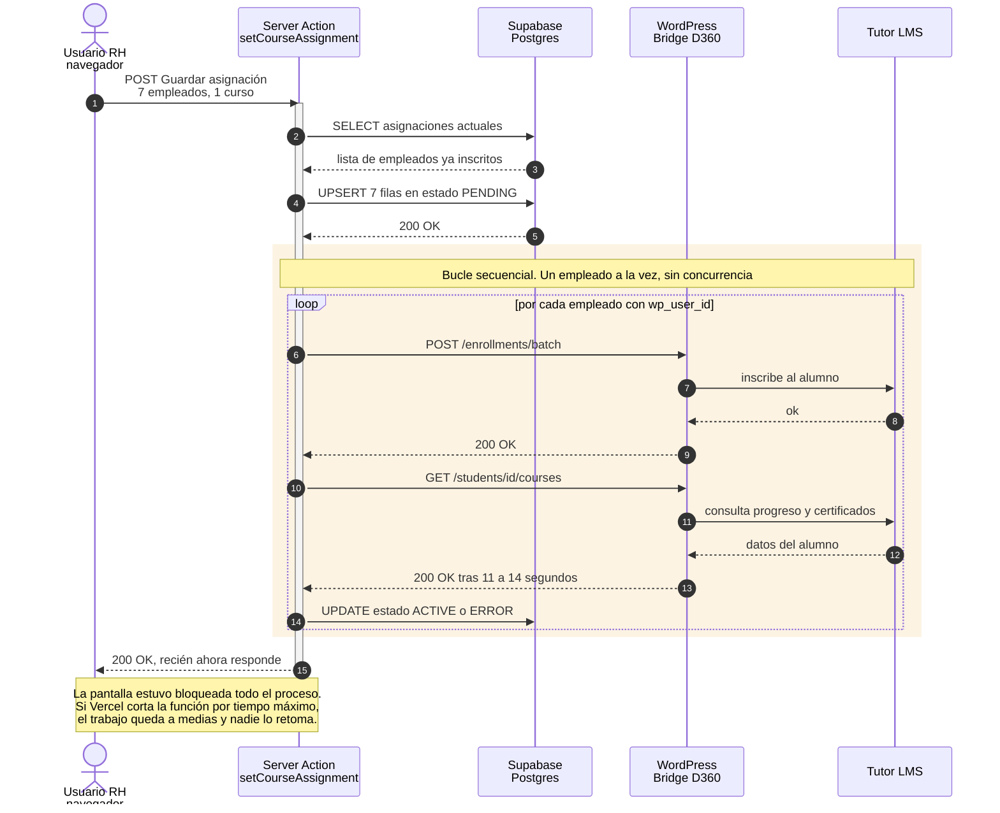
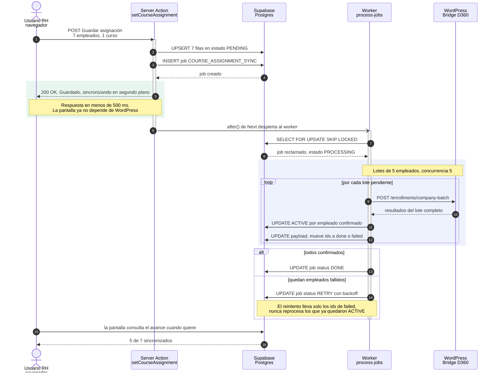
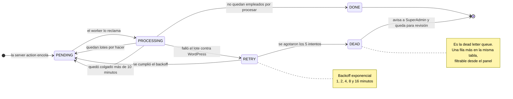
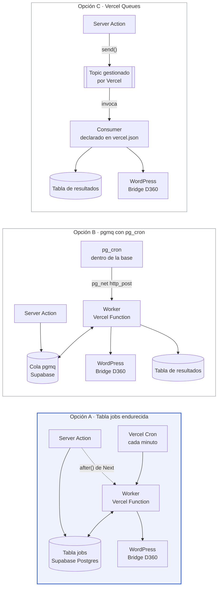

# Plan de cola para la asignación de cursos

**Fecha:** 7 de septiembre de 2026
**Alcance:** mover la asignación de cursos del portal de RH a trabajo en segundo plano, con reintentos y resultados guardados, usando la infraestructura ya contratada en Vercel y Supabase.

Informes relacionados: [INFORME-RENDIMIENTO.md](INFORME-RENDIMIENTO.md) · [PENDIENTES-RENDIMIENTO.md](PENDIENTES-RENDIMIENTO.md)

---

## 1. Resumen ejecutivo

Guardar una asignación de cursos ejecuta hoy todo el trabajo dentro del request HTTP: escribe en base de datos, llama a WordPress una vez por empleado y espera la confirmación de cada uno antes de responder. La pantalla queda bloqueada durante todo el proceso y un corte a mitad de camino deja el trabajo incompleto sin que nadie lo retome.

La propuesta es que la server action escriba las filas, cree un único job con la lista completa de asignaciones y responda de inmediato. Un worker procesa ese job por lotes, guarda el resultado de cada empleado y reintenta solo los que fallaron.


| Concepto               | Hoy                            | Con la propuesta                   |
| ------------------------ | -------------------------------- | ------------------------------------ |
| Respuesta a RH         | espera a WordPress             | menos de 500 ms                    |
| Fallo parcial          | se pierde                      | se reintenta solo lo fallido       |
| Corte de la función   | trabajo a medias, sin registro | el job sigue en la cola            |
| Visibilidad del avance | ninguna                        | estado por empleado en pantalla    |
| Infraestructura nueva  | no aplica                      | ninguna, en la opción recomendada |

**Advertencia importante.** La cola cambia quién espera, no cuánto se tarda. El costo de fondo está en el plugin de WordPress, donde cada consulta de verificación tarda de 11 a 14 segundos. Ese punto se trata en la sección 7.

---

## 2. Situación medida

Mediciones tomadas el 6 de septiembre de 2026 contra `betatutorlms.desarrolla360.com` (plugin versión 0.3.0).


| Endpoint                | Tiempo | HTTP | Nota                         |
| ------------------------- | -------: | -----: | ------------------------------ |
| `/health`               | 0.66 s |  200 | plugin operativo             |
| `/courses`              | 0.27 s |  200 | catálogo completo           |
| `/students/265/courses` | 10.8 s |  200 | alumno real, primera corrida |
| `/students/265/courses` | 14.2 s |  200 | segunda corrida              |
| `/students/265/courses` | 12.0 s |  200 | tercera corrida              |
| `/students/265/courses` | 11.0 s |  200 | cuarta corrida               |

El endpoint `/students/{id}/courses` se invoca una vez por empleado dentro del bucle de asignación. Es el costo dominante.

> **Nota sobre el entorno local.** Una prueba hecha con los cursos 101 y 102 de la base local devolvió 21 segundos, pero esos cursos no existen en el WordPress de destino, así que el bridge falla rápido. Ese número no representa producción. Las cifras válidas son las de la tabla anterior, tomadas con un alumno que sí existe en el sitio remoto.

---

## 3. Lo que ya existe

La tabla `jobs` de [`src/lib/jobs.ts`](../src/lib/jobs.ts) no es un borrador. Ya resuelve varias piezas que normalmente hay que construir desde cero.

Equivalencias con Amazon SQS, para ubicar rápido lo que hay y lo que falta:


| Concepto en SQS           | Implementación actual                            | Estado  | Ubicación                 |
| --------------------------- | --------------------------------------------------- | --------- | ---------------------------- |
| Queue                     | tabla`jobs` en Postgres                           | Existe  | `prisma/schema.prisma:480` |
| SendMessage               | `prisma.job.create`                               | Existe  | `jobs.ts:71`               |
| Visibility timeout        | `status = PROCESSING` con reclamo atómico        | Existe  | `jobs.ts:392`              |
| Mensaje huérfano         | `PROCESSING` de más de 10 min vuelve a `PENDING` | Existe  | `jobs.ts:372`              |
| DelaySeconds              | columna`next_attempt_at`                          | Existe  | `jobs.ts:380`              |
| Backoff exponencial       | solo en el envío de correo                       | Parcial | `jobs.ts:118`              |
| ReceiveCount              | dentro del payload, solo en correo                | Parcial | `jobs.ts:114`              |
| Dead letter queue         | no hay, el job queda en`ERROR`                    | Falta   | `jobs.ts:415`              |
| Disparador del consumidor | cron de Vercel cada minuto                        | Lento   | `vercel.json`              |
| Consola de la cola        | no hay pantalla de jobs                           | Falta   | no aplica                  |

Tres flujos ya usan esta cola: `PACKAGE_ENROLLMENT_SYNC` (asignación de paquete completo desde SuperAdmin), `CSV_EMPLOYEE_BRIDGE_SYNC` (importación masiva) y `EMAIL_SEND`.

**Conclusión de esta sección:** no falta una cola. Falta que la asignación de cursos la use, y falta completar cuatro piezas de la cola existente.

### 3.1 Flujo actual



---

## 4. Lo que debe mejorarse

Seis puntos concretos, cada uno con su ubicación en el código.

### 4.1 Un fallo cancela el job completo

En `processPendingJobs` el bloque `catch` marca el job como `ERROR` y termina ([`jobs.ts:415`](../src/lib/jobs.ts)). Solo el envío de correo reintenta. Si WordPress devuelve un 502 a mitad de una asignación de 30 personas, nadie lo vuelve a intentar.

### 4.2 El contador de intentos vive en el payload

`attempts` es un campo dentro del JSON de `EMAIL_SEND` ([`jobs.ts:114`](../src/lib/jobs.ts)). Cada tipo de job tendría que reimplementarlo. Corresponde a una columna de la tabla, igual que `next_attempt_at`.

### 4.3 Hasta 60 segundos de espera antes de arrancar

El único disparador es el cron de cada minuto declarado en `vercel.json`. Un job creado en el segundo 3 espera 57 segundos a que alguien lo tome, aunque la máquina esté libre.

### 4.4 No hay forma de ver el avance

No existe pantalla de jobs ni indicador en el portal de RH. Un trabajo incompleto se descubre por la columna "WP sync" del panel de SuperAdmin, que muestra la palabra "Error" sin el motivo, aunque el motivo sí está guardado en `employee_courses.access_error`.

### 4.5 El índice no cubre la consulta del worker

La tabla declara `@@index([status, type])`, pero el worker filtra por `status` y `next_attempt_at`, y ordena por `created_at`. Con pocos jobs no se nota. Conviene corregirlo antes de que sí se note.

### 4.6 Dos jobs iguales pueden convivir

Si RH pulsa "Guardar" dos veces se crean dos jobs para el mismo curso. No hay clave de deduplicación. Las operaciones son idempotentes, así que hoy no rompe nada, pero duplica el trabajo contra WordPress, que es precisamente la parte cara.

---

## 5. Diseño propuesto

Este diseño es independiente de la infraestructura elegida. 3 alternativas, las tres alternativas de la sección 6 ejecutan exactamente lo mismo.

### 5.1 Flujo con cola



### 5.2 Estados del job

La pieza que hoy falta y que en SQS se da por hecha: reintentos con espera creciente y un destino para los mensajes que nunca van a procesarse.



### 5.3 Reintento parcial

Este detalle evita repetir trabajo contra WordPress, que es el recurso caro. Si de 30 empleados fallan 4, el reintento lleva solo esos 4.

El payload de `PACKAGE_ENROLLMENT_SYNC` ya insinúa el patrón con `processedEmployeeIds`. La propuesta lo vuelve la regla general.

```jsonc
{
  "companyId": "uuid-de-la-empresa",
  "courseId": 28528,
  "courseName": "Auditoría de Seguridad de la Cadena de Suministros",
  "toAdd":    ["emp-1", "emp-2", "emp-5"],   // pendientes de inscribir
  "toRemove": ["emp-9"],                     // pendientes de quitar
  "done":     ["emp-3", "emp-4"],            // confirmados, no se repiten
  "failed":   [
    { "id": "emp-7", "error": "timeout", "attempts": 2 }
  ]
}
```

Cada pasada del worker mueve identificadores de `toAdd` hacia `done` o hacia `failed`. El job se cierra cuando `toAdd` queda vacío. Un empleado que agota sus intentos deja su fila en `ERROR` con el motivo guardado, y el resto de la asignación no se ve afectada.

### 5.4 Cambios en el esquema

```prisma
model Job {
  // campos actuales, sin cambios

  attempts        Int      @default(0)
  max_attempts    Int      @default(5)
  dedupe_key      String?  @unique   // evita el doble clic en Guardar
  progress        Json?              // { total: 30, done: 26, failed: 1 }

  @@index([status, next_attempt_at, created_at])
}
```

Se añade `DEAD` al enum `JobStatus`.

### 5.5 Reclamo del job

Hoy el worker usa `updateMany` con condición sobre el estado, que funciona pero serializa el reclamo. Con `SELECT ... FOR UPDATE SKIP LOCKED` varios workers pueden tomar trabajo de la misma cola sin bloquearse entre ellos, que es el mecanismo que usa SQS por dentro.

> **Restricción de Supabase.** La aplicación se conecta por el pooler en modo transacción (puerto 6543). Ese `SELECT ... FOR UPDATE SKIP LOCKED` debe ir dentro de una transacción de Prisma resuelta en una sola ida y vuelta. Es una restricción real a tener en cuenta, no un impedimento.

---

## 6. Opciones de infraestructura

Las tres ejecutan el diseño de la sección 5. La diferencia real entre ellas es de quién es el reloj que despierta al worker.



### 6.1 Opción A: endurecer la tabla `jobs`

Añadir el tipo `COURSE_ASSIGNMENT_SYNC`, las cuatro columnas de la sección 5.4, el reintento genérico con backoff y el estado `DEAD`. Para el arranque inmediato, la server action despierta al worker con el `after()` de Next, patrón que ya se usa en [`src/lib/employee-learning.ts`](../src/lib/employee-learning.ts). El cron de cada minuto queda como red de seguridad.


| A favor                                                                    | En contra                                                                    |
| ---------------------------------------------------------------------------- | ------------------------------------------------------------------------------ |
| Cero infraestructura nueva y cero servicios en beta                        | El reloj sigue siendo de Vercel. Si el cron no dispara, nadie recoge la cola |
| Todo es Prisma y TypeScript, con SQL crudo solo en el reclamo del job      | Hacer polling sobre una tabla castiga la base a mucho volumen                |
| Los tres flujos que ya usan la cola heredan reintentos y DLQ el mismo día |                                                                              |
| Se prueba en local sin depender de servicios externos                      |                                                                              |

### 6.2 Opción B: Supabase Queues con pgmq y pg_cron

`pgmq` es una cola de mensajes dentro de Postgres, que Supabase expone como producto. Ofrece la semántica de SQS de forma directa: `send`, `read` con visibility timeout, `archive` y métricas de la cola. El worker se despierta con `pg_cron` llamando por `pg_net` al endpoint de Vercel, o mediante una Edge Function.


| A favor                                                             | En contra                                                                      |
| --------------------------------------------------------------------- | -------------------------------------------------------------------------------- |
| El reloj vive en la base. Si Vercel falla, los mensajes siguen ahí | Convivirían dos colas, o habría que migrar los tres flujos existentes        |
| Es el mismo modelo mental de SQS, con los mismos nombres            | `pgmq` no se maneja con Prisma. Todo pasa por `$queryRaw`, sin tipado          |
| Métricas de cola incluidas                                         | Los resultados por empleado siguen necesitando tabla propia                    |
|                                                                     | `pg_net` dispara y olvida. Diagnosticar un worker que no arrancó es incómodo |

### 6.3 Opción C: Vercel Queues

Servicio gestionado de Vercel. La server action llama a `send('asignaciones', payload)` y un consumidor declarado en `vercel.json` recibe la invocación de la plataforma. El grupo de consumo configura `retryAfterSeconds` y el retraso inicial. La documentación indica concurrencia sin límite por grupo y mensajes de hasta 100 MB.


| A favor                                                                                                         | En contra                                                                           |
| ----------------------------------------------------------------------------------------------------------------- | ------------------------------------------------------------------------------------- |
| Es la que menos código de plomería requiere                                                                   | Está en beta. Para un portal con clientes reales, ese punto suele decidir          |
| Los reintentos son de la plataforma                                                                             | No incluye dead letter queue. Hay que manejar el mensaje envenenado en el código   |
| Los mensajes nuevos tienen prioridad sobre los reintentos, así que un mensaje problemático no bloquea la cola | Ata esta pieza a Vercel. Hoy la aplicación es portable porque su cola es una tabla |
|                                                                                                                 | Precio y límites aún se mueven, por estar en beta                                 |

---

## 7. Opción recomendada

**Opción A: endurecer la tabla `jobs`.**

Tres razones, en orden de peso.

**Primera: ninguna alternativa de cola resuelve el problema de fondo.** El costo está en que `/students/{id}/courses` tarda de 11 a 14 segundos por empleado. Con la cola el usuario de RH deja de esperar, que ya es una mejora sustancial, pero la sincronización sigue tardando lo mismo. Cambiar de infraestructura de cola no reduce ese tiempo.

**Segunda: la escala no lo justifica.** El portal atiende alrededor de 150 estudiantes. La tabla `jobs` con un cron por minuto cubre ese volumen con holgura. `pgmq` y Vercel Queues resuelven problemas de volumen que este sistema no tiene, y ambos agregan un componente más que mantener y documentar.

**Tercera: la opción A es evolución, no reemplazo.** Los tres flujos que ya usan la cola ganan reintentos y dead letter queue sin modificarlos. Con B o C, la asignación de cursos quedaría en un sistema distinto al de los otros tres, una división que después resulta difícil de justificar.

**Cuándo reconsiderar.** Si aparecen empresas de miles de empleados, o si Vercel Queues sale de beta con precio estable. Migrar de A hacia C más adelante es un cambio acotado, porque el diseño del job no cambia. Solo cambia quién lo despierta.

### 7.1 Lo que esta propuesta no resuelve

Después de aplicar el plan, guardar una asignación responderá en menos de 500 ms, pero los empleados seguirán tardando en aparecer como `ACTIVE`.

La causa está en el plugin de WordPress. La función `d360_bridge_enrich_student_courses` llama a `d360_bridge_get_course_certificate_debug_data` para cada curso del alumno, siempre. Esa función usa `d360_bridge_probe_student_certificate_pages`, que descarga 13 páginas HTML completas del propio WordPress y busca el texto `cert_hash=` con una expresión regular. En el sitio actual, 12 de esas 13 rutas responden 404 devolviendo 144 KB cada una.

El bucle solo se corta cuando encuentra un hash de certificado. Un alumno con 0 % de avance no tiene ninguno, así que recorre las 13 páginas completas, por cada curso.

Ese bloque produce datos de depuración que el plugin guarda en `raw.d360_certificate` y que el portal nunca lee.

---

## 8. Plan por fases

Las dos primeras fases se pueden entregar por separado y ya producen una mejora visible.


| Fase | Alcance                            | Verificación                                                             |
| ------ | ------------------------------------ | --------------------------------------------------------------------------- |
| 1    | Reintentos y DLQ para toda la cola | Un job que falla reintenta con backoff y termina en`DEAD` tras 5 intentos |
| 2    | La asignación pasa a la cola      | Guardar 7 personas responde en menos de 500 ms y las 7 quedan`ACTIVE`     |
| 3    | Visibilidad del avance             | RH ve "sincronizando 3 de 7". SuperAdmin ve el motivo del error           |
| 4    | Corrección del plugin             | `/students/{id}/courses` baja de 11 s a menos de 1 s                      |

### Fase 1: base de la cola

Columnas `attempts`, `max_attempts`, `dedupe_key` y `progress`. Estado `DEAD` en el enum. Extraer el backoff del envío de correo hacia una función reutilizable por cualquier tipo de job. Corregir el índice.

Sin tocar todavía la asignación de cursos. Los tres flujos existentes ganan reintentos, lo que permite verificar el mecanismo antes de construir sobre él.

### Fase 2: la asignación pasa a la cola

Nuevo tipo `COURSE_ASSIGNMENT_SYNC` con el payload de reintento parcial de la sección 5.3. La server action escribe las filas en `PENDING`, crea el job y responde. El worker usa el endpoint por lotes existente `bridgeCompanyBatchEnrollAndEnsureAccess` junto con `mapWithConcurrency`, ambos ya presentes en el repositorio.

### Fase 3: visibilidad

En el portal de RH, un aviso de avance leyendo los `access_status` que ya existen. En SuperAdmin, mostrar el `access_error` en el chip "WP sync", que hoy solo muestra la palabra "Error", y una pantalla de jobs que liste los que quedaron en `DEAD`.

Esta fase evita tener que consultar la base de datos para saber qué falló.

### Fase 4: el plugin de WordPress

Sacar `d360_bridge_get_course_certificate_debug_data` del camino normal, dejándola tras un parámetro de depuración explícito o restringida a los cursos completados. Reemplazar las 13 rutas fijas de `d360_bridge_get_student_certificate_candidate_urls` por la ruta real que expone Tutor mediante `tutor_utils()->get_tutor_dashboard_page_permalink()`.

Va al final por dependencia de despliegue, no por importancia: el plugin se sube a WordPress de forma separada de este repositorio. Puede adelantarse si hay quien lo despliegue.

---

## 9. Decisiones pendientes

Tres preguntas que cambian el plan y que requieren definición antes de empezar.

1. **¿Se confirma la opción A, o se prefiere la B por cercanía con SQS?** Trabajar con el modelo mental que el equipo ya domina tiene valor real y es una razón legítima para elegir B.
2. **¿El endpoint de inscripción del plugin es idempotente?** Los reintentos dependen de ello. Si volver a inscribir a un alumno ya inscrito produce error o duplicados, hay que corregirlo en el plugin antes de la fase 1.
3. **¿Quién despliega el plugin de WordPress?** Define si la fase 4 puede adelantarse o queda al final de forma obligatoria.

---

## Anexo: origen de los datos

- Mediciones de latencia: `curl` contra `betatutorlms.desarrolla360.com`, 6 de septiembre de 2026.
- Estados de asignación: consulta directa a `employee_courses` en la base de Supabase del entorno local. En el momento de la consulta: 9,934 filas en `ACTIVE`, 99 en `ERROR`, 3 en `PENDING`.
- Código del plugin: `wordpress-plugin/desarrolla360-bridge/`, versión 0.3.0.
- Documentación de Vercel Queues y Supabase Queues consultada el 6 de septiembre de 2026.
